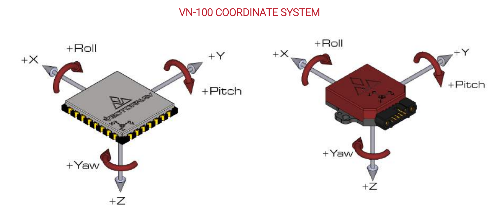
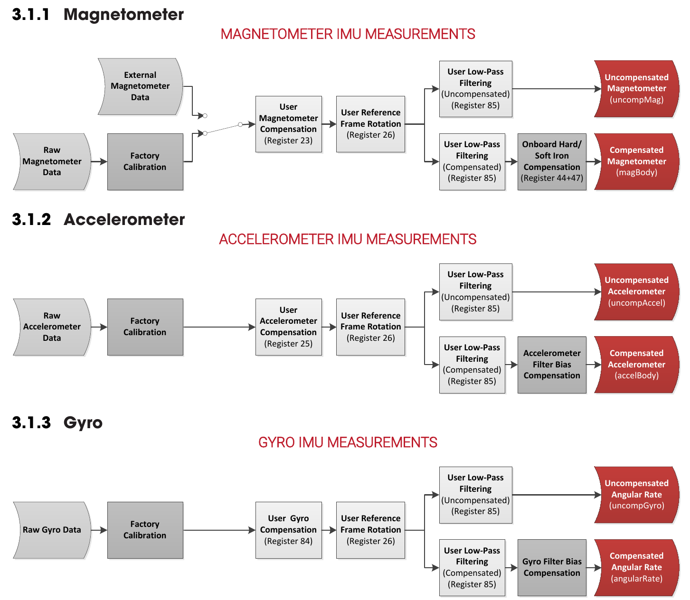

# vectornav

A minimal driver for VectorNav IMUs

## Setup

### Setup dependancies

```bash
sudo apt-get install libspdlog-dev
```

### Setup build

```bash
mkdir -p catkin_ws/src
cd catkin_ws/src
git clone git@github.com:ntnu-arl/vectornav.git
cd ..
catkin config -DCMAKE_BUILD_TYPE=Release
catkin build
```

## Usage

### Setting up custom udev rules

```bash
cd catkin_ws/src
sudo cp vectornav/udev/* /etc/udev/rules.d/
sudo udevadm control --reload
```

Note:

1. The USB latency timer should be set to 1 for the IMU to avoid the [bunching up of IMU messages](https://github.com/ntnu-arl/vectornav/issues/5). The udev rules automatically does this for you.
2. The attributes in the udev rule here may not match the attributes for your specific ftdi-usb converter. You can use `udevadm info --attribute-walk /dev/ttyUSB0` (change `/dev/ttyUSB0` to the port that the converter is connected to) to find the values that you can enter in the udev rule and `udevadm test $(udevadm info --query=path --name=/dev/ttyUSB0)` to test whether the new rule works as expected.
3. If the udev rules do not load, you may need to restart the computer. This only needs to be done once during the setup.

### Setting up the parameters

Modify the `config/vn100_params.yaml` per your requirements.

### Running the node

```bash
cd catkin_ws
source devel/setup.bash
roslaunch vectornav vectornav.launch
```

## Additional Documentation



The default output from the VN100 is in the NED coordinate system.



For any questions, please contact

- [Nikhil Khedekar](mailto:nikhil.v.khedekar@ntnu.no)
